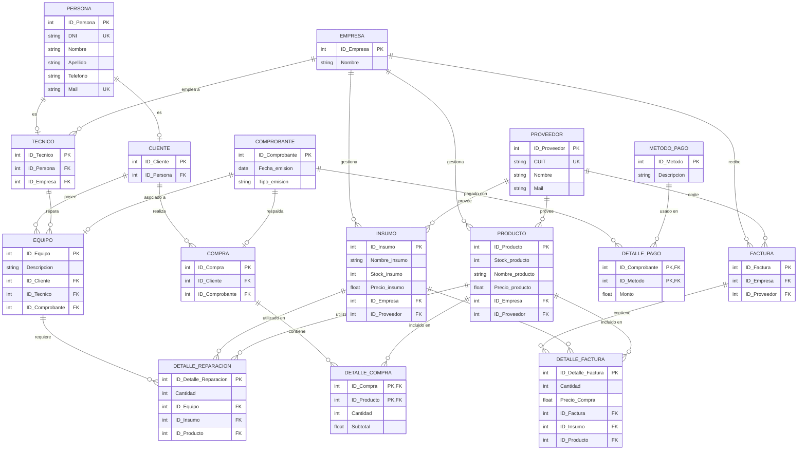

```mermaid
erDiagram
    PERSONA {
        int ID_Persona PK
        string DNI UK
        string Nombre
        string Apellido
        string Telefono
        string Mail UK
    }
    
    CLIENTE {
        int ID_Cliente PK
        int ID_Persona FK
    }
    
    TECNICO {
        int ID_Tecnico PK
        int ID_Persona FK
        int ID_Empresa FK
    }
    
    EMPRESA {
        int ID_Empresa PK
        string Nombre
    }
    
    PROVEEDOR {
        int ID_Proveedor PK
        string CUIT UK
        string Nombre
        string Mail
    }
    
    INSUMO {
        int ID_Insumo PK
        string Nombre_insumo
        int Stock_insumo
        float Precio_insumo
        int ID_Empresa FK
        int ID_Proveedor FK
    }
    
    PRODUCTO {
        int ID_Producto PK
        int Stock_producto
        string Nombre_producto
        float Precio_producto
        int ID_Empresa FK
        int ID_Proveedor FK
    }
    
    FACTURA {
        int ID_Factura PK
        int ID_Empresa FK
        int ID_Proveedor FK
    }
    
    DETALLE_FACTURA {
        int ID_Detalle_Factura PK
        int Cantidad
        float Precio_Compra
        int ID_Factura FK
        int ID_Insumo FK
        int ID_Producto FK
    }
    
    EQUIPO {
        int ID_Equipo PK
        string Descripcion
        int ID_Cliente FK
        int ID_Tecnico FK
        int ID_Comprobante FK
    }
    
    DETALLE_REPARACION {
        int ID_Detalle_Reparacion PK
        int Cantidad
        int ID_Equipo FK
        int ID_Insumo FK
        int ID_Producto FK
    }
    
    COMPROBANTE {
        int ID_Comprobante PK
        date Fecha_emision
        string Tipo_emision
    }
    
    METODO_PAGO {
        int ID_Metodo PK
        string Descripcion
    }
    
    DETALLE_PAGO {
        int ID_Comprobante PK,FK
        int ID_Metodo PK,FK
        float Monto
    }
    
    COMPRA {
        int ID_Compra PK
        int ID_Cliente FK
        int ID_Comprobante FK
    }
    
    DETALLE_COMPRA {
        int ID_Compra PK,FK
        int ID_Producto PK,FK
        int Cantidad
        float Subtotal
    }

    PERSONA ||--o| CLIENTE : "es"
    PERSONA ||--o| TECNICO : "es"
    EMPRESA ||--o{ TECNICO : "emplea a"
    EMPRESA ||--o{ INSUMO : "gestiona"
    PROVEEDOR ||--o{ INSUMO : "provee"
    EMPRESA ||--o{ PRODUCTO : "gestiona"
    PROVEEDOR ||--o{ PRODUCTO : "provee"
    EMPRESA ||--o{ FACTURA : "recibe"
    PROVEEDOR ||--o{ FACTURA : "emite"
    FACTURA ||--o{ DETALLE_FACTURA : "contiene"
    INSUMO ||--o{ DETALLE_FACTURA : "incluido en"
    PRODUCTO ||--o{ DETALLE_FACTURA : "incluido en"
    CLIENTE ||--o{ EQUIPO : "posee"
    TECNICO ||--o{ EQUIPO : "repara"
    COMPROBANTE ||--o| EQUIPO : "asociado a"
    EQUIPO ||--o{ DETALLE_REPARACION : "requiere"
    INSUMO ||--o{ DETALLE_REPARACION : "utilizado en"
    PRODUCTO ||--o{ DETALLE_REPARACION : "utilizado en"
    COMPROBANTE ||--o{ DETALLE_PAGO : "pagado con"
    METODO_PAGO ||--o{ DETALLE_PAGO : "usado en"
    CLIENTE ||--o{ COMPRA : "realiza"
    COMPROBANTE ||--o| COMPRA : "respalda"
    COMPRA ||--o{ DETALLE_COMPRA : "contiene"
    PRODUCTO ||--o{ DETALLE_COMPRA : "incluido en"
```
