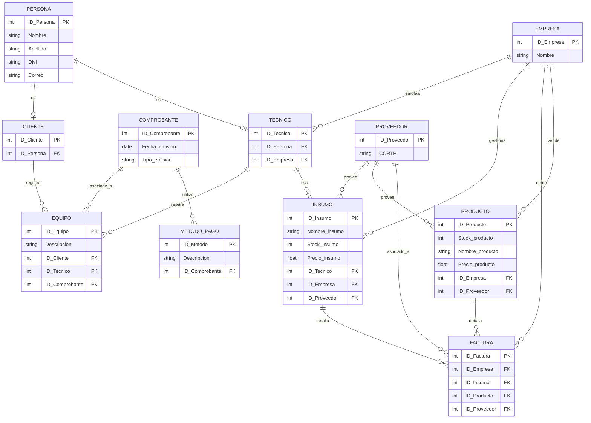

```mermaid
erDiagram
    PERSONA {
        int ID_Persona PK
        string Nombre
        string Apellido
        string DNI
        string Correo
    }
    CLIENTE {
        int ID_Cliente PK
        int ID_Persona FK
    }
    METODO_PAGO {
        int ID_Metodo PK
        string Descripcion
        int ID_Comprobante FK
    }
    COMPROBANTE {
        int ID_Comprobante PK
        date Fecha_emision
        string Tipo_emision
    }
    EQUIPO {
        int ID_Equipo PK
        string Descripcion
        int ID_Cliente FK
        int ID_Tecnico FK
        int ID_Comprobante FK
    }
    TECNICO {
        int ID_Tecnico PK
        int ID_Persona FK
        int ID_Empresa FK
    }
    INSUMO {
        int ID_Insumo PK
        string Nombre_insumo
        int Stock_insumo
        float Precio_insumo
        int ID_Tecnico FK
        int ID_Empresa FK
        int ID_Proveedor FK
    }
    EMPRESA {
        int ID_Empresa PK
        string Nombre
    }
    FACTURA {
        int ID_Factura PK
        int ID_Empresa FK
        int ID_Insumo FK
        int ID_Producto FK
        int ID_Proveedor FK
    }
    PRODUCTO {
        int ID_Producto PK
        int Stock_producto
        string Nombre_producto
        float Precio_producto
        int ID_Empresa FK
        int ID_Proveedor FK
    }
    PROVEEDOR {
        int ID_Proveedor PK
        string CORTE
    }

    %% Relaciones
    PERSONA ||--o| CLIENTE : "es"
    PERSONA ||--o| TECNICO : "es"
    CLIENTE ||--o{ EQUIPO : "registra"
    TECNICO ||--o{ EQUIPO : "repara"
    COMPROBANTE ||--o{ EQUIPO : "asociado_a"
    COMPROBANTE ||--o{ METODO_PAGO : "utiliza"
    EMPRESA ||--o{ TECNICO : "emplea"
    EMPRESA ||--o{ INSUMO : "gestiona"
    EMPRESA ||--o{ FACTURA : "emite"
    EMPRESA ||--o{ PRODUCTO : "vende"
    PROVEEDOR ||--o{ INSUMO : "provee"
    PROVEEDOR ||--o{ PRODUCTO : "provee"
    PROVEEDOR ||--o{ FACTURA : "asociado_a"
    INSUMO ||--o{ FACTURA : "detalla"
    PRODUCTO ||--o{ FACTURA : "detalla"
    TECNICO ||--o{ INSUMO : "usa"
```
